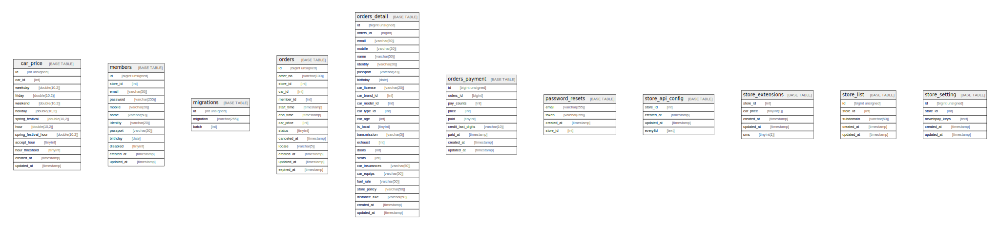

# storeapp

## Tables

| Name | Columns | Comment | Type |
| ---- | ------- | ------- | ---- |
| [car_price](car_price.md) | 13 |  | BASE TABLE |
| [members](members.md) | 12 |  | BASE TABLE |
| [migrations](migrations.md) | 3 |  | BASE TABLE |
| [orders](orders.md) | 14 |  | BASE TABLE |
| [orders_detail](orders_detail.md) | 25 |  | BASE TABLE |
| [orders_payment](orders_payment.md) | 9 |  | BASE TABLE |
| [password_resets](password_resets.md) | 4 |  | BASE TABLE |
| [store_api_config](store_api_config.md) | 4 |  | BASE TABLE |
| [store_extensions](store_extensions.md) | 5 |  | BASE TABLE |
| [store_list](store_list.md) | 5 |  | BASE TABLE |
| [store_setting](store_setting.md) | 5 |  | BASE TABLE |

## Relations

---

> Generated by [tbls](https://github.com/k1LoW/tbls)
