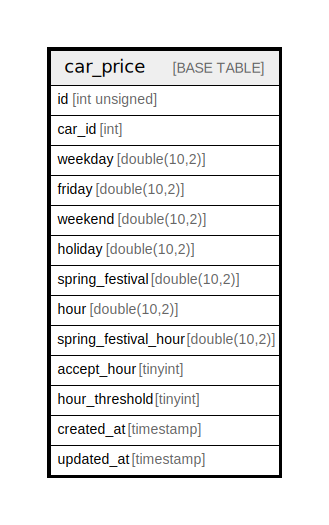

# car_price

## Description

<details>
<summary><strong>Table Definition</strong></summary>

```sql
CREATE TABLE `car_price` (
  `id` int unsigned NOT NULL AUTO_INCREMENT,
  `car_id` int NOT NULL,
  `weekday` double(10,2) NOT NULL DEFAULT '0.00',
  `friday` double(10,2) NOT NULL DEFAULT '0.00',
  `weekend` double(10,2) NOT NULL DEFAULT '0.00',
  `holiday` double(10,2) NOT NULL DEFAULT '0.00',
  `spring_festival` double(10,2) NOT NULL DEFAULT '0.00',
  `hour` double(10,2) NOT NULL DEFAULT '0.00',
  `spring_festival_hour` double(10,2) NOT NULL DEFAULT '0.00',
  `accept_hour` tinyint NOT NULL DEFAULT '0',
  `hour_threshold` tinyint NOT NULL DEFAULT '0',
  `created_at` timestamp NULL DEFAULT NULL,
  `updated_at` timestamp NULL DEFAULT NULL,
  PRIMARY KEY (`id`),
  KEY `car_price_car_id_index` (`car_id`)
) ENGINE=InnoDB AUTO_INCREMENT=[Redacted by tbls] DEFAULT CHARSET=utf8mb4 COLLATE=utf8mb4_unicode_ci
```

</details>

## Columns

| Name | Type | Default | Nullable | Extra Definition | Children | Parents | Comment |
| ---- | ---- | ------- | -------- | ---------------- | -------- | ------- | ------- |
| id | int unsigned |  | false | auto_increment |  |  |  |
| car_id | int |  | false |  |  |  |  |
| weekday | double(10,2) | 0.00 | false |  |  |  |  |
| friday | double(10,2) | 0.00 | false |  |  |  |  |
| weekend | double(10,2) | 0.00 | false |  |  |  |  |
| holiday | double(10,2) | 0.00 | false |  |  |  |  |
| spring_festival | double(10,2) | 0.00 | false |  |  |  |  |
| hour | double(10,2) | 0.00 | false |  |  |  |  |
| spring_festival_hour | double(10,2) | 0.00 | false |  |  |  |  |
| accept_hour | tinyint | 0 | false |  |  |  |  |
| hour_threshold | tinyint | 0 | false |  |  |  |  |
| created_at | timestamp |  | true |  |  |  |  |
| updated_at | timestamp |  | true |  |  |  |  |

## Constraints

| Name | Type | Definition |
| ---- | ---- | ---------- |
| PRIMARY | PRIMARY KEY | PRIMARY KEY (id) |

## Indexes

| Name | Definition |
| ---- | ---------- |
| car_price_car_id_index | KEY car_price_car_id_index (car_id) USING BTREE |
| PRIMARY | PRIMARY KEY (id) USING BTREE |

## Relations



---

> Generated by [tbls](https://github.com/k1LoW/tbls)
