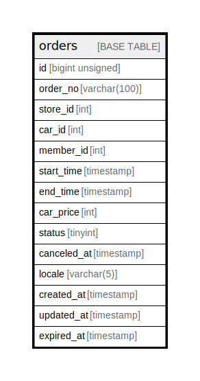

# orders

## Description

<details>
<summary><strong>Table Definition</strong></summary>

```sql
CREATE TABLE `orders` (
  `id` bigint unsigned NOT NULL AUTO_INCREMENT,
  `order_no` varchar(100) CHARACTER SET utf8mb4 COLLATE utf8mb4_unicode_ci NOT NULL,
  `store_id` int NOT NULL,
  `car_id` int NOT NULL,
  `member_id` int NOT NULL,
  `start_time` timestamp NULL DEFAULT NULL,
  `end_time` timestamp NULL DEFAULT NULL,
  `car_price` int NOT NULL,
  `status` tinyint NOT NULL,
  `canceled_at` timestamp NULL DEFAULT NULL,
  `locale` varchar(5) CHARACTER SET utf8mb4 COLLATE utf8mb4_unicode_ci NOT NULL,
  `created_at` timestamp NULL DEFAULT NULL,
  `updated_at` timestamp NULL DEFAULT NULL,
  `expired_at` timestamp NULL DEFAULT NULL,
  PRIMARY KEY (`id`)
) ENGINE=InnoDB AUTO_INCREMENT=[Redacted by tbls] DEFAULT CHARSET=utf8mb4 COLLATE=utf8mb4_unicode_ci
```

</details>

## Columns

| Name | Type | Default | Nullable | Extra Definition | Children | Parents | Comment |
| ---- | ---- | ------- | -------- | ---------------- | -------- | ------- | ------- |
| id | bigint unsigned |  | false | auto_increment |  |  |  |
| order_no | varchar(100) |  | false |  |  |  |  |
| store_id | int |  | false |  |  |  |  |
| car_id | int |  | false |  |  |  |  |
| member_id | int |  | false |  |  |  |  |
| start_time | timestamp |  | true |  |  |  |  |
| end_time | timestamp |  | true |  |  |  |  |
| car_price | int |  | false |  |  |  |  |
| status | tinyint |  | false |  |  |  |  |
| canceled_at | timestamp |  | true |  |  |  |  |
| locale | varchar(5) |  | false |  |  |  |  |
| created_at | timestamp |  | true |  |  |  |  |
| updated_at | timestamp |  | true |  |  |  |  |
| expired_at | timestamp |  | true |  |  |  |  |

## Constraints

| Name | Type | Definition |
| ---- | ---- | ---------- |
| PRIMARY | PRIMARY KEY | PRIMARY KEY (id) |

## Indexes

| Name | Definition |
| ---- | ---------- |
| PRIMARY | PRIMARY KEY (id) USING BTREE |

## Relations



---

> Generated by [tbls](https://github.com/k1LoW/tbls)
