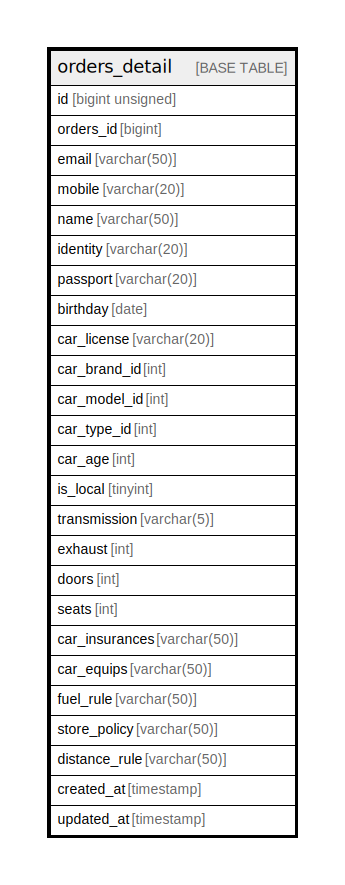

# orders_detail

## Description

<details>
<summary><strong>Table Definition</strong></summary>

```sql
CREATE TABLE `orders_detail` (
  `id` bigint unsigned NOT NULL AUTO_INCREMENT,
  `orders_id` bigint NOT NULL,
  `email` varchar(50) CHARACTER SET utf8mb4 COLLATE utf8mb4_unicode_ci NOT NULL,
  `mobile` varchar(20) CHARACTER SET utf8mb4 COLLATE utf8mb4_unicode_ci NOT NULL,
  `name` varchar(50) CHARACTER SET utf8mb4 COLLATE utf8mb4_unicode_ci NOT NULL,
  `identity` varchar(20) CHARACTER SET utf8mb4 COLLATE utf8mb4_unicode_ci DEFAULT NULL,
  `passport` varchar(20) CHARACTER SET utf8mb4 COLLATE utf8mb4_unicode_ci DEFAULT NULL,
  `birthday` date NOT NULL,
  `car_license` varchar(20) CHARACTER SET utf8mb4 COLLATE utf8mb4_unicode_ci DEFAULT NULL,
  `car_brand_id` int NOT NULL,
  `car_model_id` int NOT NULL,
  `car_type_id` int NOT NULL,
  `car_age` int NOT NULL,
  `is_local` tinyint NOT NULL,
  `transmission` varchar(5) CHARACTER SET utf8mb4 COLLATE utf8mb4_unicode_ci NOT NULL,
  `exhaust` int NOT NULL,
  `doors` int NOT NULL,
  `seats` int NOT NULL,
  `car_insurances` varchar(50) CHARACTER SET utf8mb4 COLLATE utf8mb4_unicode_ci NOT NULL,
  `car_equips` varchar(50) CHARACTER SET utf8mb4 COLLATE utf8mb4_unicode_ci NOT NULL,
  `fuel_rule` varchar(50) CHARACTER SET utf8mb4 COLLATE utf8mb4_unicode_ci NOT NULL,
  `store_policy` varchar(50) CHARACTER SET utf8mb4 COLLATE utf8mb4_unicode_ci NOT NULL,
  `distance_rule` varchar(50) CHARACTER SET utf8mb4 COLLATE utf8mb4_unicode_ci NOT NULL,
  `created_at` timestamp NULL DEFAULT NULL,
  `updated_at` timestamp NULL DEFAULT NULL,
  PRIMARY KEY (`id`),
  UNIQUE KEY `orders_detail_orders_id_unique` (`orders_id`)
) ENGINE=InnoDB AUTO_INCREMENT=[Redacted by tbls] DEFAULT CHARSET=utf8mb4 COLLATE=utf8mb4_unicode_ci
```

</details>

## Columns

| Name | Type | Default | Nullable | Extra Definition | Children | Parents | Comment |
| ---- | ---- | ------- | -------- | ---------------- | -------- | ------- | ------- |
| id | bigint unsigned |  | false | auto_increment |  |  |  |
| orders_id | bigint |  | false |  |  |  |  |
| email | varchar(50) |  | false |  |  |  |  |
| mobile | varchar(20) |  | false |  |  |  |  |
| name | varchar(50) |  | false |  |  |  |  |
| identity | varchar(20) |  | true |  |  |  |  |
| passport | varchar(20) |  | true |  |  |  |  |
| birthday | date |  | false |  |  |  |  |
| car_license | varchar(20) |  | true |  |  |  |  |
| car_brand_id | int |  | false |  |  |  |  |
| car_model_id | int |  | false |  |  |  |  |
| car_type_id | int |  | false |  |  |  |  |
| car_age | int |  | false |  |  |  |  |
| is_local | tinyint |  | false |  |  |  |  |
| transmission | varchar(5) |  | false |  |  |  |  |
| exhaust | int |  | false |  |  |  |  |
| doors | int |  | false |  |  |  |  |
| seats | int |  | false |  |  |  |  |
| car_insurances | varchar(50) |  | false |  |  |  |  |
| car_equips | varchar(50) |  | false |  |  |  |  |
| fuel_rule | varchar(50) |  | false |  |  |  |  |
| store_policy | varchar(50) |  | false |  |  |  |  |
| distance_rule | varchar(50) |  | false |  |  |  |  |
| created_at | timestamp |  | true |  |  |  |  |
| updated_at | timestamp |  | true |  |  |  |  |

## Constraints

| Name | Type | Definition |
| ---- | ---- | ---------- |
| orders_detail_orders_id_unique | UNIQUE | UNIQUE KEY orders_detail_orders_id_unique (orders_id) |
| PRIMARY | PRIMARY KEY | PRIMARY KEY (id) |

## Indexes

| Name | Definition |
| ---- | ---------- |
| PRIMARY | PRIMARY KEY (id) USING BTREE |
| orders_detail_orders_id_unique | UNIQUE KEY orders_detail_orders_id_unique (orders_id) USING BTREE |

## Relations



---

> Generated by [tbls](https://github.com/k1LoW/tbls)
