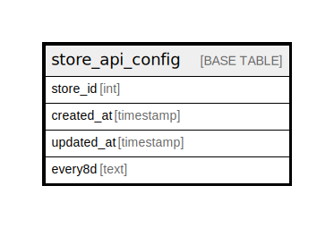

# store_api_config

## Description

<details>
<summary><strong>Table Definition</strong></summary>

```sql
CREATE TABLE `store_api_config` (
  `store_id` int NOT NULL,
  `created_at` timestamp NULL DEFAULT NULL,
  `updated_at` timestamp NULL DEFAULT NULL,
  `every8d` text CHARACTER SET utf8mb4 COLLATE utf8mb4_unicode_ci,
  KEY `store_api_config_store_id_index` (`store_id`)
) ENGINE=InnoDB DEFAULT CHARSET=utf8mb4 COLLATE=utf8mb4_unicode_ci
```

</details>

## Columns

| Name | Type | Default | Nullable | Children | Parents | Comment |
| ---- | ---- | ------- | -------- | -------- | ------- | ------- |
| store_id | int |  | false |  |  |  |
| created_at | timestamp |  | true |  |  |  |
| updated_at | timestamp |  | true |  |  |  |
| every8d | text |  | true |  |  |  |

## Indexes

| Name | Definition |
| ---- | ---------- |
| store_api_config_store_id_index | KEY store_api_config_store_id_index (store_id) USING BTREE |

## Relations



---

> Generated by [tbls](https://github.com/k1LoW/tbls)
